# ShopSphere Modern Data Lakehouse — Complete Lab Outputs

## 📌 Project Overview

This repository contains the **complete and consolidated outputs** for the ShopSphere Modern Data Lakehouse lab.  
The original outputs were separated into **Task A, Task B, Task C, Task D, Task E, and Task F**. This README combines them into one clearly structured document and places the available screenshots/evidence in the logical execution order.

### Technology Stack

- **PostgreSQL 16** — source transactional database
- **MinIO** — S3-compatible object storage
- **DuckDB** — analytical query engine
- **Parquet** — columnar data format
- **Docker / Docker Compose** — containerized environment
- **SQL** — transformation and analytical queries
- **Star Schema** — analytical data model
- **ELT / Data Lakehouse workflow** — extract, load, transform and analyze

---

# 🗂️ Complete Task Flow

The outputs are organized in the following execution sequence:

| Task | Purpose | Main Evidence |
|---|---|---|
| **Task A** | Source data, MinIO layout and partitioned target data | Dataset, MinIO and partition screenshots |
| **Task B** | Data validation, duplicate checks and reproducibility | Raw rows, duplicate checks and checksums |
| **Task C** | Analytical/star-schema data and dashboard query | Fact table and dashboard-query evidence |
| **Task D** | Output/query verification | Output evidence |
| **Task E** | Query execution plans and performance analysis | Five EXPLAIN / EXPLAIN ANALYZE screenshots |
| **Task F** | Final data-quality and reconciliation checks | Duplicate, line-type, store and reconciliation evidence |

---

# A. Task A — Source Data, Storage Layout & Partitioning

## Objective

Task A demonstrates the movement of source data into the lakehouse storage layer and the organization of the target data using a structured partitioning layout.

## Evidence

### A1. Entire Dataset

Shows the complete source/target dataset used in the workflow.


### A2. Source Flat Files

Shows the source flat-file representation before the data is organized into the analytical storage layout.


### A3. MinIO Layout

Shows the object-storage structure inside MinIO.


### A4. Target Partition

Shows the final partitioned target data.

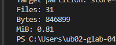

### Task A Result

The evidence establishes the flow:

**Source Flat Files → MinIO/Object Storage → Partitioned Target Data**

---

# B. Task B — Data Validation & Reproducibility

## Objective

Task B verifies the loaded data and checks that the dataset does not contain unintended duplicates. It also provides checksum evidence across repeated runs.

## Evidence

### B1. Raw Rows

Displays the raw rows used for validation.


### B2. Duplicate-Key Check

Verifies duplicate keys in the relevant dataset.

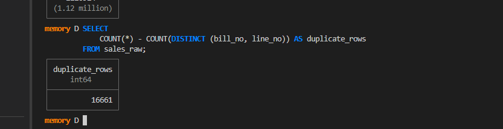

### B3. Unique & Duplicate Summary

Provides the unique/duplicate validation result.


### B4. Run 1 Checksum

First checksum/reproducibility result.

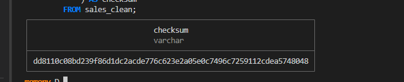

### B5. Run 2 Checksum

Second checksum/reproducibility result.


### B6. Run 3 Checksum

Third checksum/reproducibility result.


### Task B Result

The evidence covers:

- Raw-data verification
- Duplicate-key validation
- Unique/duplicate counts
- Repeated-run checksum verification
- Reproducibility of the data-processing result

---

# C. Task C — Analytical Data & Dashboard Query

## Objective

Task C demonstrates the analytical data layer and provides evidence for the fact table and the query used for dashboard/analytics output.

## Evidence

### C1. Fact Table Rows

Shows rows from the analytical fact table.

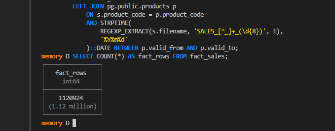

### C2. Dashboard Query

The dashboard query used to retrieve analytical results is preserved as text evidence.

[Open Dashboard Query](Evidence/C_dashboard_query.txt)

### Task C Result

The evidence demonstrates that the transformed data is available in an analytical structure suitable for dashboard and reporting queries.

---

# D. Task D — Output Verification

## Objective

Task D records the final output evidence produced during the workflow.

### D1. Output Evidence

The detailed output/query evidence is preserved in the accompanying text file.

[Open Task D Output Evidence](Evidence/D_output_evidence.txt)

### Task D Result

This stage provides a documented record of the expected analytical/output results.

---

# E. Task E — Query Plans & Performance Analysis

## Objective

Task E evaluates query execution behavior using **EXPLAIN / EXPLAIN ANALYZE** evidence.

The five screenshots should be reviewed in order because they represent the sequence of query-plan/performance checks.

### E1. EXPLAIN Evidence — Query 1

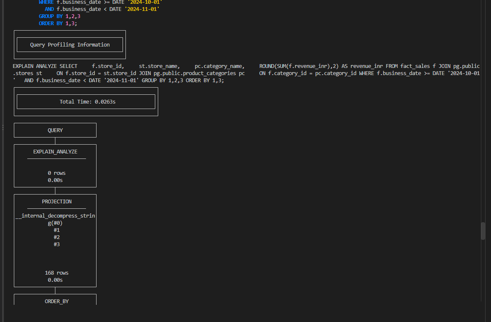

### E2. EXPLAIN Evidence — Query 2

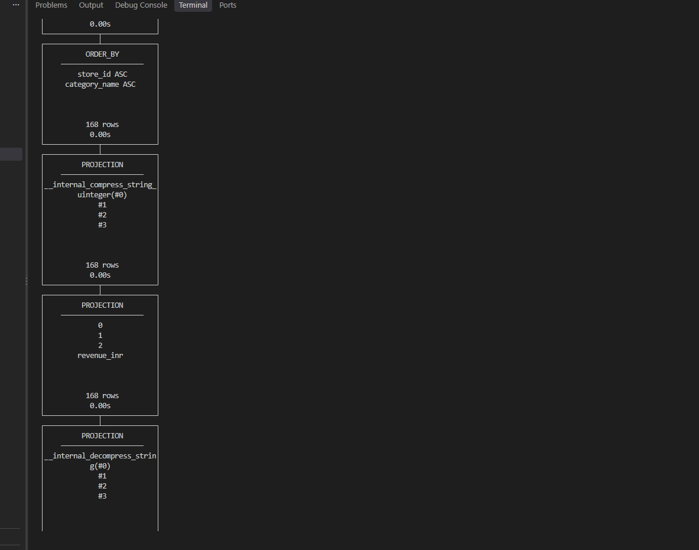

### E3. EXPLAIN Evidence — Query 3

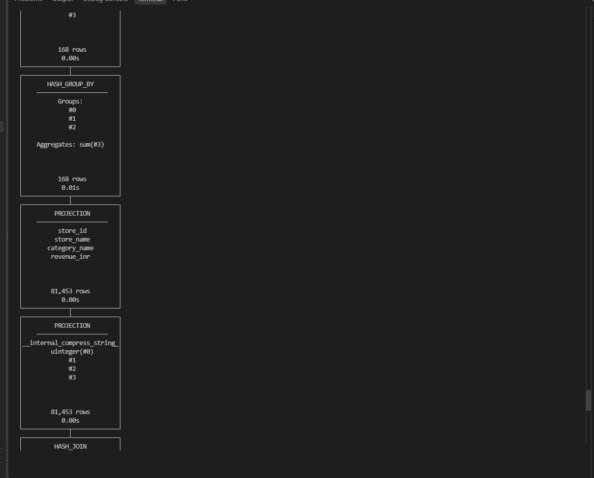

### E4. EXPLAIN Evidence — Query 4

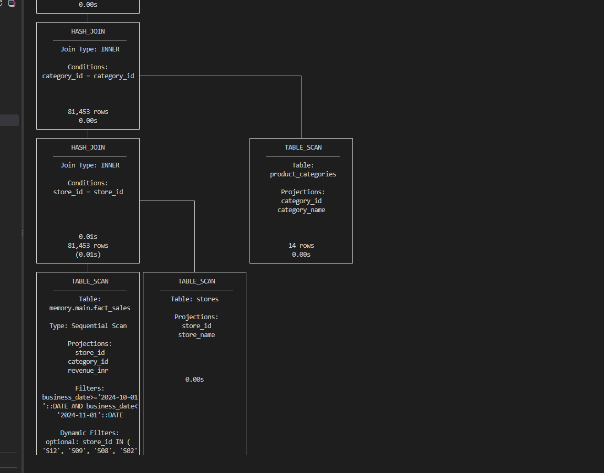

### E5. EXPLAIN Evidence — Query 5

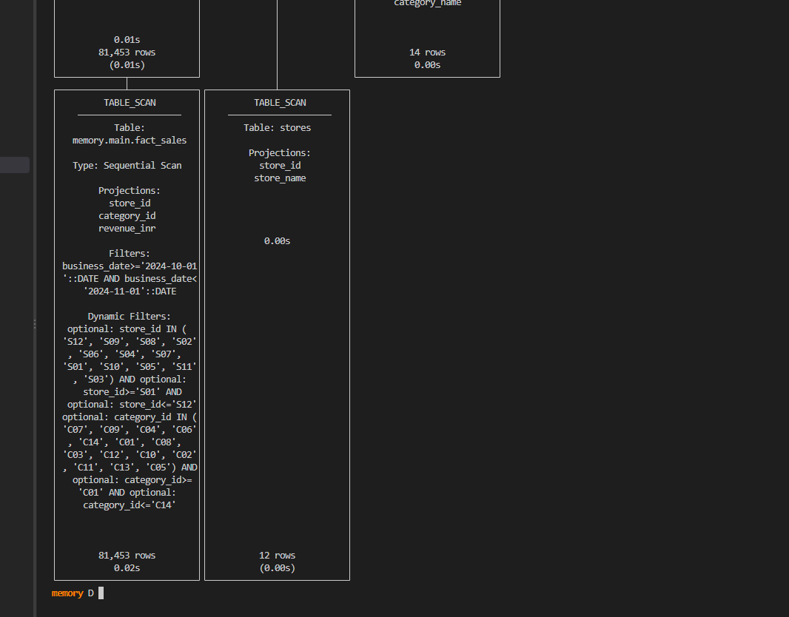

### Task E Result

These screenshots provide evidence for:

- Query execution plans
- Query execution behavior
- Cost/plan information
- Performance analysis
- Comparison of query execution strategies where applicable

---

# F. Task F — Final Data Quality & Reconciliation

## Objective

Task F performs the final validation checks on the analytical data.

## Evidence

### F1. Duplicate Check

Final duplicate validation.

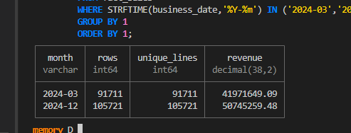

### F2. Line Type Breakdown

Breakdown of the relevant line/item types.

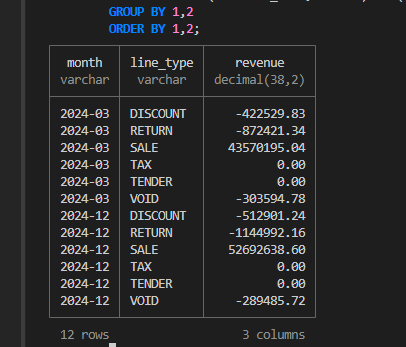

### F3. Store Breakdown

Breakdown of the data by store.

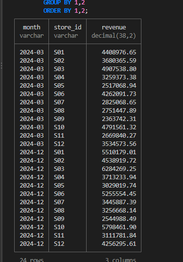

### F4. Reconciliation

Final reconciliation between the relevant source and analytical/output values.

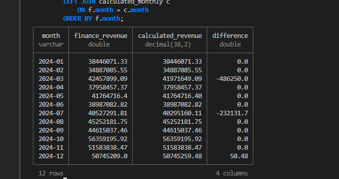

### Task F Result

The final evidence covers:

- Duplicate validation
- Line-type distribution
- Store-level distribution
- Source-to-target/output reconciliation

---

# 🔄 End-to-End Data Pipeline

The complete lab can be understood as the following pipeline:

```text
                    ┌──────────────────────┐
                    │   Source Data        │
                    │   Flat Files         │
                    └──────────┬───────────┘
                               │
                               ▼
                    ┌──────────────────────┐
                    │    PostgreSQL        │
                    │ Transactional Source │
                    └──────────┬───────────┘
                               │
                               ▼
                    ┌──────────────────────┐
                    │       MinIO          │
                    │  Object Storage      │
                    └──────────┬───────────┘
                               │
                               ▼
                    ┌──────────────────────┐
                    │      Parquet         │
                    │ Partitioned Data     │
                    └──────────┬───────────┘
                               │
                               ▼
                    ┌──────────────────────┐
                    │       DuckDB         │
                    │ Analytical Engine    │
                    └──────────┬───────────┘
                               │
                               ▼
                    ┌──────────────────────┐
                    │     Star Schema      │
                    │ Fact + Dimensions    │
                    └──────────┬───────────┘
                               │
                               ▼
                    ┌──────────────────────┐
                    │ Analytics / Dashboard│
                    │   SQL Queries        │
                    └──────────┬───────────┘
                               │
                               ▼
                    ┌──────────────────────┐
                    │ Validation &         │
                    │ Performance Checks   │
                    └──────────────────────┘
```

---

# 🧪 Validation Summary

The combined evidence demonstrates the following validation layers:

### 1. Storage Validation
- Source files are identified.
- MinIO object-storage layout is documented.
- Target data is organized into partitions.

### 2. Data Quality Validation
- Raw rows are inspected.
- Duplicate keys are checked.
- Unique/duplicate results are documented.

### 3. Reproducibility Validation
- Multiple checksum runs are recorded.
- Run 1, Run 2 and Run 3 evidence can be compared to confirm repeatability.

### 4. Analytical Validation
- Fact-table rows are inspected.
- Dashboard/analytical SQL is preserved.
- Final analytical outputs are documented.

### 5. Performance Validation
- Multiple EXPLAIN/EXPLAIN ANALYZE outputs are captured.
- Query plans can be reviewed using the Task E screenshots.

### 6. Final Reconciliation
- Duplicate checks are repeated at the final stage.
- Line-type and store-level breakdowns are documented.
- Reconciliation evidence verifies the final result.

---

# 📁 Final Folder Structure

All screenshots from **Task A–F are now separated into one dedicated `Screenshots` folder**. Text-based evidence is kept in `Evidence`.

```text
Final_Outputs/
│
├── README.md
│
├── Screenshots/
│   ├── A_entire_dataset.png
│   ├── A_source_flat_files.png
│   ├── A_minio_layout.png
│   ├── A_target_partition.png
│   ├── B_raw_rows.png
│   ├── B_duplicate_key_check.png
│   ├── B_unique_and_duplicates.png
│   ├── B_run1_checksum.png
│   ├── B_run2_checksum.png
│   ├── B_run3_checksum.png
│   ├── C_fact_rows.png
│   ├── D_output_evidence.png  # if an image version is added later
│   ├── E_explain_1.png
│   ├── E_explain_2.png
│   ├── E_explain_3.png
│   ├── E_explain_4.png
│   ├── E_explain_5.png
│   ├── F_duplicate_check.png
│   ├── F_line_type_breakdown.png
│   ├── F_store_breakdown.png
│   └── F_reconciliation.png
│
└── Evidence/
    ├── C_dashboard_query.txt
    └── D_output_evidence.txt
```

# ✅ Final Submission Checklist

- [x] Task A evidence consolidated
- [x] Task B evidence consolidated
- [x] Task C evidence consolidated
- [x] Task D evidence consolidated
- [x] Task E evidence consolidated
- [x] Task F evidence consolidated
- [x] Screenshots arranged in execution order
- [x] Text evidence files linked
- [x] End-to-end pipeline documented
- [x] Validation stages documented
- [x] Recommended folder structure included

---

## 🎯 Conclusion

The combined outputs document the complete ShopSphere Modern Data Lakehouse workflow — from **source data ingestion and MinIO storage** through **Parquet partitioning, DuckDB analytics, star-schema modeling, validation, reconciliation, and query-performance analysis**.

This README is intended to serve as the **single entry point for the complete lab evidence**, while the individual screenshots and text files provide the detailed proof for each task.
