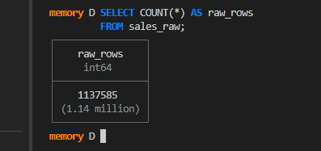
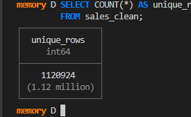
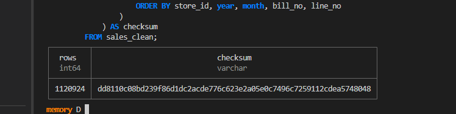
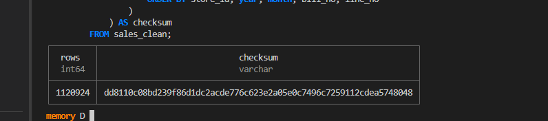

# Annapurna Stores – Part B: Idempotent Loading

## Objective
Make the sales loading process safe to run repeatedly so resends do not create duplicate logical sales lines.

## Deduplication rule
The vendor-defined safe line identity is `(bill_no, line_no)`. Source CSV files were normalized into a common schema and duplicate sales-line identities were removed using this composite key.

## Data loading results
- Source files: **4,457 CSV files**
- Raw rows: **1,137,585**
- Duplicate rows removed: **16,661**
- Unique/final rows: **1,120,924**
- Final rows: **1,120,924**
- Distinct `(bill_no, line_no)` keys: **1,120,924**

The final row count equals the number of distinct composite keys, confirming that the cleaned table contains no duplicate sales-line identities.

## Idempotency test

The cleaned table was rebuilt and the canonical result was hashed using SHA-256.

| Run | Rows | SHA-256 checksum |
|---|---:|---|
| 1 | 1,120,924 | `d8d11c08bd239f86d1dc2acde776c623e2a05e0c7496c7259112cdea5748048` |
| 2 | 1,120,924 | `d8d11c08bd239f86d1dc2acde776c623e2a05e0c7496c7259112cdea5748048` |
| 3 | 1,120,924 | `d8d11c08bd239f86d1dc2acde776c623e2a05e0c7496c7259112cdea5748048` |

The row count and SHA-256 checksum are identical across all three runs. Therefore, the transformation is deterministic and idempotent for the loaded source set.

## Evidence

### Raw row count

### Duplicate and unique-row validation

### Run 1 checksum

### Run 2 checksum

### Run 3 checksum

## Conclusion
Part B is complete. The loading logic uses `(bill_no, line_no)` as the stable line identity, removes duplicate logical lines, and produces the same final row count and checksum across three executions.
