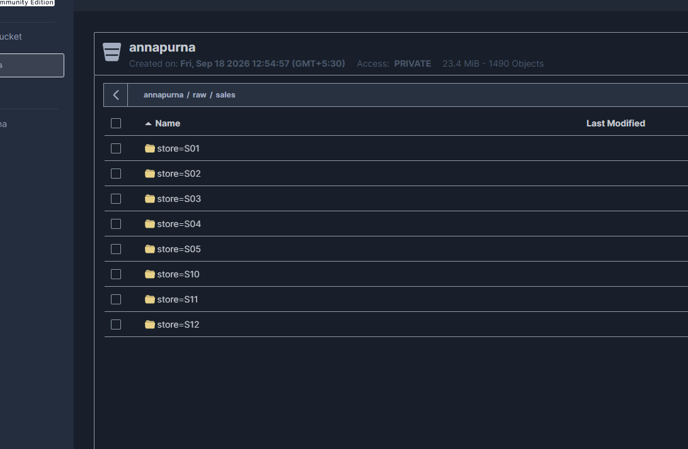
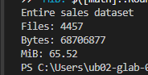
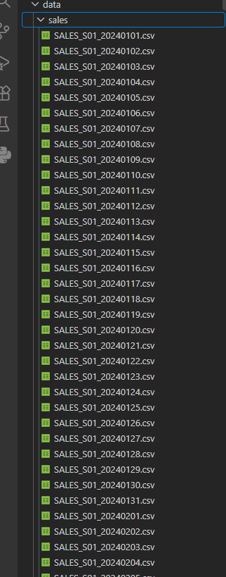

# Annapurna Stores – Data Platform Practical

## Current Progress / Evidence

This README records the work completed so far. It is a working draft and can be updated as Parts B–F are completed.

---

## Part A – Platform and Data Landing

### Platform architecture

- **PostgreSQL** – relational database for master/reference data.
- **MinIO** – object store for raw daily sales files.
- **DuckDB** – analytical query engine for analytical and federated queries.

### PostgreSQL master data

The supplied `masters.sql` was loaded into PostgreSQL. The following master tables are available:

- `stores`
- `product_categories`
- `products`
- `price_revisions`

The `stores` table was verified to contain **12 stores**.

### Source sales files

The supplied sales directory contains **4,457 CSV files**.

The filename provides the store and business date. Example:

```text
SALES_S01_20241001.csv
```

This represents store `S01` and business date `2024-10-01`.

### Partitioned layout

The sales files were reorganized using:

```text
sales/
├── store=S01/
│   └── year=2024/
│       ├── month=01/
│       ├── month=02/
│       └── ...
├── store=S02/
├── store=S03/
├── ...
└── store=S12/
```

The same organization was uploaded to MinIO under:

```text
annapurna/raw/sales/
```

with partitions for `store=S01` through `store=S12`.

### MinIO evidence



### Partition-pruning evidence

For **S01 / October 2024**:

- Files: **31**
- Bytes: **846,899 bytes**
- Size: **0.81 MiB**


For the complete sales dataset:

- Files: **4,457**
- Bytes: **68,706,877 bytes**
- Size: **65.52 MiB**



### Comparison

| Query scope | Files | Size |
|---|---:|---:|
| S01 / October 2024 partition | 31 | 0.81 MiB |
| Entire sales dataset | 4,457 | 65.52 MiB |

Therefore, a query targeting S01 for October 2024 can be restricted to the corresponding store/year/month partition instead of potentially considering the entire flat collection of 4,457 files.

### Original source evidence

The original sales directory contained the files directly in one flat folder before partitioning.



---

## Part B – Idempotent Ingestion

**Status: Pending.**

The vendor notes specify that resends can exist and that the safe line identity is:

```text
(bill_no, line_no)
```

The ingestion process will use this line identity to prevent repeated loading of the same logical sales line.

Required evidence:

- Run 1: row count and checksum
- Run 2: row count and checksum
- Run 3: row count and checksum
- All three runs should produce the same result.

---

## Part C – Dashboard / Analytical Model

**Status: Pending.**

The dashboard model will use a fact table at sales-line grain and dimensions for:

- Store
- Product
- Product category
- Date / day of week / month

Store descriptive information should remain in dimensions rather than being repeated on millions of fact rows.

Revenue calculations must account for the supplied line types. `TAX` and `TENDER` are not revenue rows, while `SALE`, `RETURN`, `DISCOUNT`, and `VOID` affect the revenue calculation according to the vendor notes.

Product history must be handled using product validity dates / `product_sk`, because product codes can be retired and later reused for different products.

---

## Part D – Historical Prices

**Status: Pending.**

Historical pricing will use the PostgreSQL `price_revisions` table rather than assuming that the current product price represents the historical price.

The reporting period will be joined to the applicable `effective_from` / `effective_to` revision for the relevant `product_sk`.

Required evidence:

- March 2024 historical-price query.
- Same query for another reporting period.
- Results demonstrating period-specific pricing.

---

## Part E – Federated Query

**Status: Pending.**

Intended architecture:

```text
MinIO sales data  ←→  DuckDB  ←→  PostgreSQL master data
```

The required query will join sales data in the object store with store/product/category information in PostgreSQL without first copying one side into the other.

Required evidence:

- Federated query result.
- `EXPLAIN` / `EXPLAIN ANALYZE` output showing where relevant operations are evaluated.

---

## Part F – Monthly Reconciliation

**Status: Pending.**

Pipeline revenue will be compared against the supplied `finance_monthly.csv` values for each month of 2024.

Each mismatch will be classified as:

1. **Source-data problem**
2. **Revenue-definition difference**
3. **Pipeline bug**

The vendor notes specify that `TENDER` represents the amount actually paid and should not be summed with revenue line amounts. An October result that is approximately twice the correct amount should trigger inspection of line-type handling, especially accidental inclusion of `TENDER` rows.

---

## Project Structure

```text
annapurna/
├── data/
│   ├── sales/
│   ├── truth/
│   ├── billing_notes.md
│   ├── finance_monthly.csv
│   └── masters.sql
├── postgres/
│   └── init.sql
├── duckdb/
├── parquet/
├── report/
├── scripts/
└── docker-compose.yml
```

## Current Status

| Part | Status |
|---|---|
| A – Platform & landing | **Completed / evidence captured** |
| B – Idempotent ingestion | Pending |
| C – Dashboard model | Pending |
| D – Historical prices | Pending |
| E – Federated query | Pending |
| F – Reconciliation | Pending |
